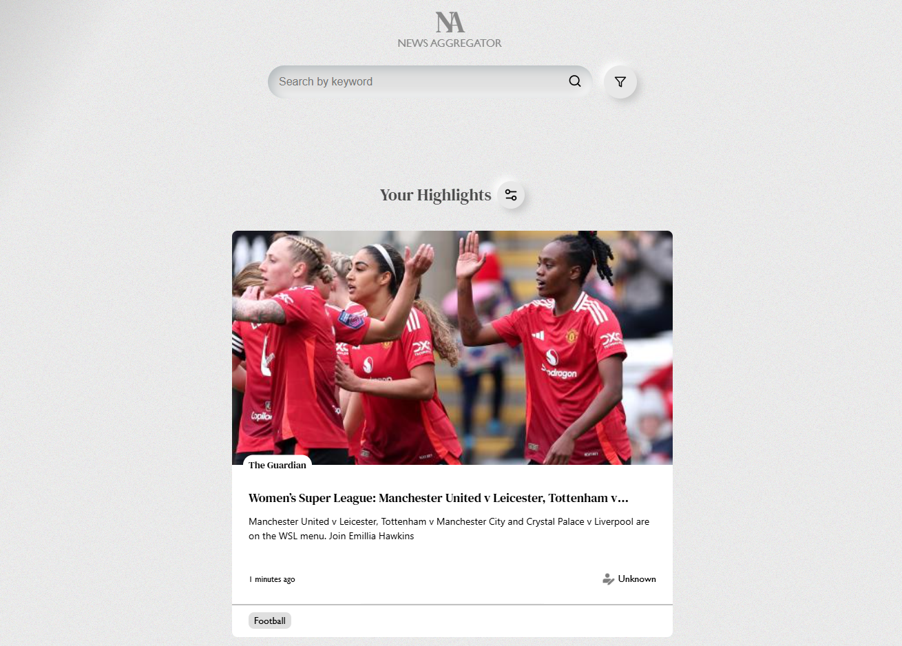

# innoscripta Case Study Assignment

A scalable news aggregator implemented for innoscripta frontend developer case study assignment.


I designed the app to fetch articles from multiple news APIsin flexible enough to be able to easily extend and add any other API sources.

- The project emphasizes modularity and scalability, performance, and maintainability.


## Overview

**Current API Sources:**

- [NewsAPI](https://newsapi.ai/)
- [The Guardian](https://open-platform.theguardian.com/documentation/)
- [NewsAPI.org](https://newsapi.org/)

*Easily extendable to support any other API source.*

---

## Features

- **Multi-Source Aggregation:** Fetches news articles from various APIs.
- **Unified Display:** Aggregates and sorts articles in one centralized location.
- **Infinite Scrolling:** Seamlessly loads additional content as the user scrolls.
- **Optimized Rendering:** Uses virtualized rendering to enhance performance.
- **React Query Integration:** Efficient data fetching and caching.
- **Autosuggestions:** Provides suggestions for categories, sources, and authors.
- **Request Optimization:** Implements debouncing and deferred execution to reduce API calls.
- **Lazy Loading:** Loads content on demand.
- **Search & Filtering:** Filter articles by title, author, source, and date.
- **Persistent Preferences:** Stores user preferences for news highlights in local storage (using redux-persist).
- **Custom Styling:** Crafted using raw CSS (challenging my skills over using Tailwind).
- **Responsive Design:** Optimized for all devices.
- **Best Practices:** Adheres to DRY, SOLID, and KISS principles.
- **Design Inspirations:** Inspired by [muz.li](https://muz.li/), [Neumorphism](https://neumorphism.io/), and [CSS-Tricks: Grainy Gradients](https://css-tricks.com/grainy-gradients/).

---

## Technologies

- **Frontend:** React, Vite, Typescript
- **Data Management:** React Query, Redux Toolkit
- **UI Enhancements:** React Virtualizer, react-icons
- **Styling:** HTML, CSS
- **Containerization:** Docker

---

## Getting Started

### Running Locally

1. **Install Dependencies:**
   ```bash
   npm install
   ```
2. **Build the Project:**
   ```bash
   npm run build
   ```
3. **Start the Preview:**
   ```bash
   npm run preview
   ```

### Running with Docker

1. **Build the Docker Image:**
   ```bash
   docker build . -t news-aggregator-shayan-valiyari
   ```
2. **Run the Container:**
   ```bash
   docker run -d -p 3000:3000 news-aggregator-shayan-valiyari
   ```

---

## Extending the API Sources

To add a new API source:

1. **Create Data Transfer Objects (DTO):**  
   Create a `dto.ts` file defining the request and response types for the new API.

2. **Implement Handlers:**  
   Define handler functions for the following methods (preferably in separate files):
   - `getPosts`
   - `getSources`
   - `getCategories`
   - `getAuthors`

3. **Develop the API Client:**  
   Create a new file for the API client. Use the `ClientFactory` class and integrate the handler functions along with other parameters (e.g., `baseUrl`, `apiKey`).

4. **Export the Client:**  
   Export the newly created client from the `index` file within the `src/clients` directory.

5. **Integrate Feature Flag:** (recommended) 
   Add an environment variable flag (recommended to manage via `src/configs/envVars.ts`) to enable or disable the new API source.

6. **Register the Client:**  
   Add the new API client to the `AvailableClients` object in the `src/configs/essentials.ts` file.

---

## Environment Variables

- **API Keys:**  
  Stored in a `.env` file. While not ideal for production, I think this approach is acceptable for the project's scope.

- **API Base URLs**

- **Feature Flags:**  
  Enable or disable features (including API sources) at build time.

- **Settings:**  
  Store configurations such as the maximum article count per API request (e.g., `VITE_MAX_POSTS_PER_API_REQUEST`).

---

## Application Workflow

- **Data Aggregation:**  
  The `useAggregatedNews` hook and `fetchAggregatedPosts.ts` file fetch and aggregate data from multiple APIs using a time-based cursor pagination technique.

- **Caching & State Management:**  
  React Query handles data caching and state management.

- **Client-Specific Data Handling:**  
  Each client fetches and transforms API data into a standardized array of `Article` objects. The `NewsFeed` component renders each article using the `Article` component.

- **Autosuggestion Feature:**  
  Autosuggestions for categories, sources, and authors are provided via:
  - `fetchAggregatedCategories.ts`
  - `fetchAggregatedSources.ts`
  - `fetchAggregatedAuthors.ts`  
  These suggestions are standardized using a global `Tag` type, ensuring consistency across different API clients.

- **Input Optimization:**  
  Input components are optimized with debouncing and deferred execution to reduce API request frequency during user interaction.

---